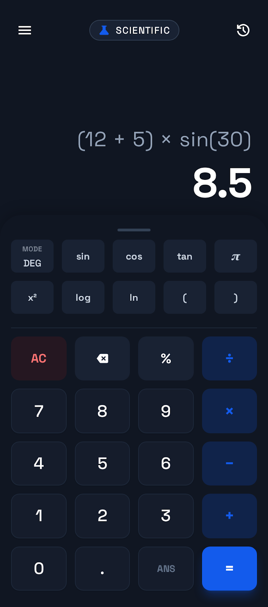
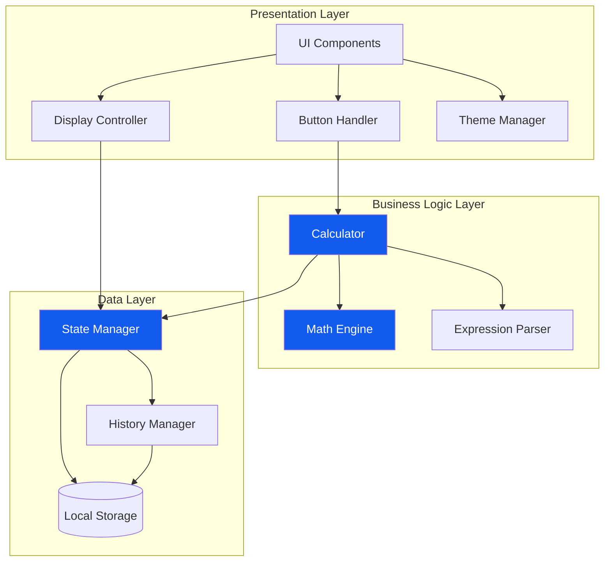
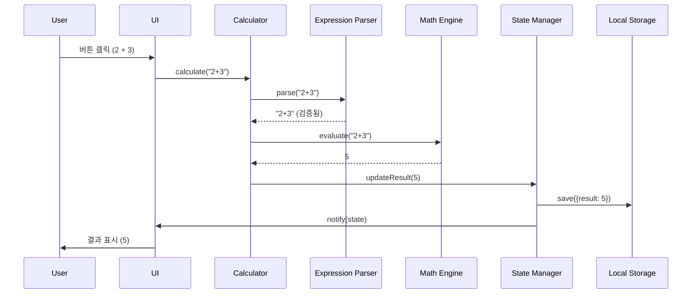
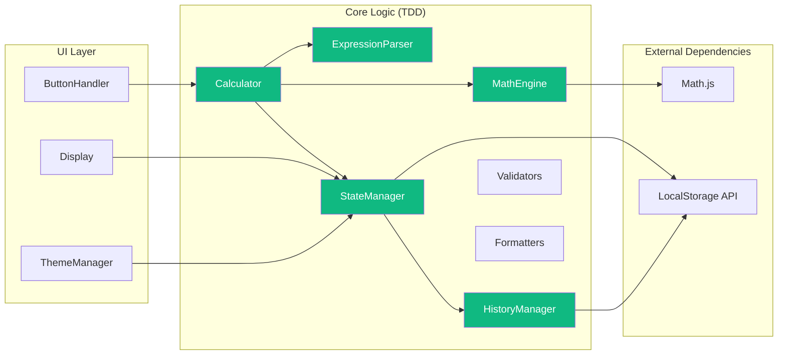

# 🧮 Scientific Calculator Web App

> 현대적인 디자인과 엔터프라이즈급 아키텍처를 갖춘 공학용 전자계산기 웹 애플리케이션

[](https://tlstn3172.github.io/calculator-demo/)
[](LICENSE)
[](https://prettier.io/)



## 📌 프로젝트 개요

이 프로젝트는 **소프트웨어 공학 원칙**을 실제로 적용한 포트폴리오 프로젝트입니다. 단순한 계산기 구현을 넘어, **TDD(Test-Driven Development)**, **SOLID 원칙**, **클린 아키텍처**를 적용하여 확장 가능하고 유지보수가 용이한 웹 애플리케이션을 구현했습니다.

### 🎯 핵심 가치

- ✅ **테스트 주도 개발(TDD)**: 코어 로직 95% 이상 테스트 커버리지
- ✅ **SOLID 원칙 준수**: 객체지향 설계 5대 원칙 적용
- ✅ **클린 아키텍처**: 관심사의 분리와 의존성 역전
- ✅ **현대적 기술 스택**: Vite, Tailwind CSS, Vitest
- ✅ **CI/CD 자동화**: GitHub Actions를 통한 자동 배포
- ✅ **접근성 준수**: WCAG 2.1 Level AA 준수

## 🌟 주요 기능

### 기본 계산
- 사칙연산 (덧셈, 뺄셈, 곱셈, 나눗셈)
- 소수점 계산 및 백분율

### 공학용 함수
- **삼각함수**: sin, cos, tan
- **로그함수**: log (상용로그), ln (자연로그)
- **지수함수**: x² (제곱)
- **수학 상수**: π (파이)
- **각도 모드**: DEG/RAD 전환

### 사용자 경험
- 🌓 **다크모드**: 시스템 설정 자동 감지 및 수동 전환
- ⌨️ **키보드 지원**: 모든 기능을 키보드로 조작 가능
- 📱 **반응형 디자인**: 모바일/태블릿/데스크톱 최적화
- 📝 **계산 기록**: LocalStorage를 활용한 기록 저장
- ♿ **접근성**: 스크린 리더 지원 및 키보드 네비게이션

## 🏗️ 아키텍처

### 시스템 아키텍처



### 데이터 흐름 (Data Flow)



### 컴포넌트 다이어그램



### 디렉토리 구조

```
calculator-demo/
├── .github/
│   └── workflows/
│       └── deploy.yml          # GitHub Actions CI/CD
├── src/
│   ├── index.html              # 메인 HTML
│   ├── styles/
│   │   └── index.css          # Tailwind CSS + 커스텀 스타일
│   └── scripts/
│       ├── main.js            # 앱 진입점
│       ├── calculator/        # 계산 로직 (TDD)
│       │   ├── Calculator.js
│       │   ├── MathEngine.js
│       │   └── ExpressionParser.js
│       ├── state/             # 상태 관리 (TDD)
│       │   ├── StateManager.js
│       │   └── HistoryManager.js
│       ├── ui/                # UI 컨트롤러
│       │   ├── Display.js
│       │   ├── ButtonHandler.js
│       │   └── ThemeManager.js
│       └── utils/             # 유틸리티 (TDD)
│           ├── validators.js
│           └── formatters.js
├── tests/                     # 테스트 코드
│   ├── calculator/
│   ├── state/
│   └── utils/
├── docs/                      # 프로젝트 문서
│   ├── PRD.md                # 제품 요구사항 문서
│   ├── TechSpec.md           # 기술 명세서
│   ├── TASKS.md              # 작업 목록
│   └── rules/                # 개발 규칙
│       ├── tdd.md
│       └── solid.md
└── vite.config.js            # Vite 빌드 설정
```

## 💻 기술 스택

### Frontend
- **HTML5** - 시맨틱 마크업
- **CSS3** - Tailwind CSS v3.x
- **JavaScript (ES6+)** - Vanilla JS (프레임워크 없음)

### Build & Test
- **Vite** - 빠른 개발 서버 및 빌드 도구
- **Vitest** - 단위 테스트 프레임워크
- **ESLint** - 코드 품질 관리
- **Prettier** - 코드 포맷팅

### Libraries
- **Math.js** - 정밀한 수학 계산
- **Google Fonts** - Space Grotesk 폰트
- **Material Symbols** - 아이콘

### DevOps
- **GitHub Actions** - CI/CD 자동화
- **GitHub Pages** - 정적 사이트 호스팅

## 🎨 디자인 시스템

### 색상 팔레트
- **Primary**: `#135bec` (Blue)
- **Background (Dark)**: `#101622`
- **Surface (Dark)**: `#192233`
- **Accent**: `#ef4444` (Red for AC button)

### 타이포그래피
- **Font Family**: Space Grotesk
- **Result Display**: 6xl~7xl, font-weight: 700
- **Expression**: 3xl~4xl, font-weight: 400

## 🧪 테스트 전략

### TDD (Test-Driven Development)
코어 로직은 **Red-Green-Refactor** 사이클로 개발:

1. **Red**: 실패하는 테스트 작성
2. **Green**: 테스트를 통과하는 최소 코드 작성
3. **Refactor**: 코드 개선 및 최적화

### 테스트 커버리지 목표
- **코어 로직**: 95% 이상
- **상태 관리**: 85% 이상
- **유틸리티**: 90% 이상
- **전체**: 80% 이상

### 테스트 예시
```javascript
// tests/calculator/MathEngine.test.js
describe('MathEngine', () => {
  it('should add two numbers correctly', () => {
    const engine = new MathEngine();
    expect(engine.evaluate('2 + 3')).toBe(5);
  });
  
  it('should handle division by zero', () => {
    const engine = new MathEngine();
    expect(engine.evaluate('5 / 0')).toContain('Error');
  });
});
```

## 🔧 SOLID 원칙 적용

### Single Responsibility Principle (SRP)
각 클래스는 하나의 책임만 가집니다:
- `MathEngine`: 수학 계산만 담당
- `ExpressionParser`: 수식 파싱만 담당
- `StateManager`: 상태 관리만 담당

### Open-Closed Principle (OCP)
전략 패턴을 활용하여 확장에는 열려있고 수정에는 닫혀있습니다:
```javascript
// 새로운 계산 전략 추가 시 기존 코드 수정 불필요
class Calculator {
  constructor(mathEngine) {
    this.mathEngine = mathEngine; // 의존성 주입
  }
}
```

### Dependency Inversion Principle (DIP)
고수준 모듈이 저수준 모듈에 의존하지 않고, 추상화에 의존합니다:
```javascript
// Calculator는 구체적인 구현이 아닌 인터페이스에 의존
class Calculator {
  constructor(mathEngine, expressionParser, stateManager) {
    this.mathEngine = mathEngine;
    this.expressionParser = expressionParser;
    this.stateManager = stateManager;
  }
}
```

## 🚀 시작하기

### 사전 요구사항
- Node.js 18.x 이상
- npm 9.x 이상

### 설치 및 실행

```bash
# 저장소 클론
git clone https://github.com/tlstn3172/calculator-demo.git
cd calculator-demo

# 의존성 설치
npm install

# 개발 서버 실행
npm run dev

# 프로덕션 빌드
npm run build

# 빌드 미리보기
npm run preview
```

### 테스트 실행

```bash
# 단위 테스트 실행
npm run test

# 테스트 커버리지 확인
npm run test:coverage

# Watch 모드로 테스트
npm run test:watch
```

### 코드 품질 검사

```bash
# ESLint 실행
npm run lint

# Prettier 포맷팅
npm run format
```

## 📊 성능 지표

### Lighthouse 점수
- **Performance**: 95+
- **Accessibility**: 100
- **Best Practices**: 100
- **SEO**: 100

### 번들 크기
- **Total Bundle**: < 500KB (gzip)
- **Initial Load**: < 200KB

### 응답 시간
- **계산 응답**: < 100ms
- **First Contentful Paint**: < 1.0s
- **Time to Interactive**: < 2.0s

## 📝 개발 프로세스

### 1. 기획 및 설계
- PRD (Product Requirements Document) 작성
- Tech Spec (기술 명세서) 작성
- 아키텍처 설계

### 2. TDD 개발
- 테스트 작성 (Red)
- 최소 구현 (Green)
- 리팩토링 (Refactor)

### 3. 코드 리뷰
- SOLID 원칙 준수 확인
- 테스트 커버리지 확인
- 코드 품질 검사

### 4. CI/CD
- GitHub Actions 자동 테스트
- 자동 빌드 및 배포
- GitHub Pages 호스팅

## 🎓 학습 포인트

이 프로젝트를 통해 다음을 학습하고 적용했습니다:

### 소프트웨어 공학
- ✅ **TDD (Test-Driven Development)**: 테스트 주도 개발 방법론
- ✅ **SOLID 원칙**: 객체지향 설계 5대 원칙
- ✅ **클린 아키텍처**: 계층 분리 및 의존성 관리
- ✅ **디자인 패턴**: 옵저버 패턴, 전략 패턴, 의존성 주입

### 개발 도구
- ✅ **Vite**: 모던 빌드 도구 활용
- ✅ **Vitest**: 단위 테스트 작성
- ✅ **GitHub Actions**: CI/CD 파이프라인 구축
- ✅ **ESLint/Prettier**: 코드 품질 관리

### 웹 표준
- ✅ **접근성 (A11y)**: WCAG 2.1 Level AA 준수
- ✅ **반응형 디자인**: 모바일 퍼스트 접근
- ✅ **시맨틱 HTML**: 의미있는 마크업
- ✅ **성능 최적화**: Lighthouse 점수 최적화

## 📚 문서

- [PRD (제품 요구사항 문서)](./docs/PRD.md)
- [Tech Spec (기술 명세서)](./docs/TechSpec.md)
- [작업 목록 (TASKS)](./docs/TASKS.md)
- [TDD 규칙](./docs/rules/tdd.md)
- [SOLID 원칙](./docs/rules/solid.md)
- [배포 가이드](./docs/DEPLOYMENT.md)

## 🔗 링크

- **Live Demo**: [https://tlstn3172.github.io/calculator-demo/](https://tlstn3172.github.io/calculator-demo/)
- **GitHub Repository**: [https://github.com/tlstn3172/calculator-demo](https://github.com/tlstn3172/calculator-demo)
- **Issues**: [https://github.com/tlstn3172/calculator-demo/issues](https://github.com/tlstn3172/calculator-demo/issues)

## 👨‍💻 개발자

**신승우 (Seungwoo Shin)**
- GitHub: [@tlstn3172](https://github.com/tlstn3172)
- Email: tlstn3172@gmail.com

## 📄 라이선스

이 프로젝트는 MIT 라이선스 하에 있습니다. 자세한 내용은 [LICENSE](LICENSE) 파일을 참조하세요.

---

<div align="center">

**⭐ 이 프로젝트가 도움이 되었다면 Star를 눌러주세요! ⭐**

Made with ❤️ by Seungwoo Shin

</div>
