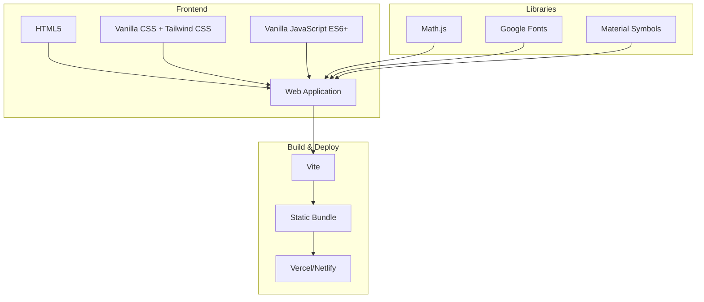
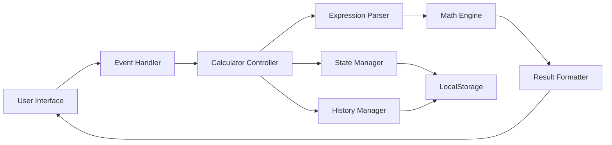
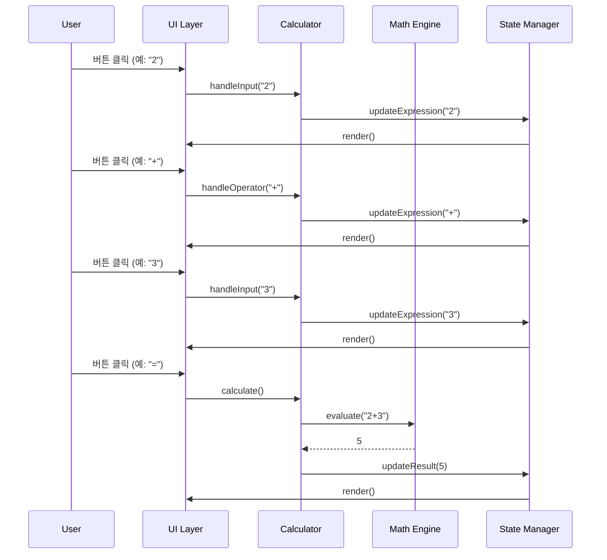

# Tech Spec: 공학용 전자계산기 웹 애플리케이션

## 문서 정보
- **프로젝트명**: Scientific Calculator Web App
- **버전**: 1.0
- **작성일**: 2025-12-23
- **관련 문서**: [PRD.md](./PRD.md)

## 목차
1. [기술 스택 개요](#1-기술-스택-개요)
2. [아키텍처 설계](#2-아키텍처-설계)
3. [프론트엔드 구현](#3-프론트엔드-구현)
4. [계산 엔진](#4-계산-엔진)
5. [상태 관리](#5-상태-관리)
6. [UI/UX 구현](#6-uiux-구현)
7. [데이터 저장](#7-데이터-저장)
8. [성능 최적화](#8-성능-최적화)
9. [테스트 전략](#9-테스트-전략)
10. [배포 전략](#10-배포-전략)

---

## 1. 기술 스택 개요

### 1.1 핵심 기술 스택



### 1.2 기술 선택 근거

| 기술 | 선택 이유 | 대안 |
|------|-----------|------|
| **Vanilla JS** | - 가벼운 번들 크기<br>- 빠른 로딩 속도<br>- 프레임워크 오버헤드 없음 | React, Vue |
| **Tailwind CSS** | - 빠른 개발 속도<br>- 일관된 디자인 시스템<br>- 작은 번들 크기 (Purge) | Bootstrap, Material-UI |
| **Math.js** | - 정밀한 수학 계산<br>- 다양한 함수 지원<br>- 수식 파싱 기능 | Decimal.js, 자체 구현 |
| **Vite** | - 빠른 개발 서버<br>- 최적화된 빌드<br>- 간단한 설정 | Webpack, Parcel |
| **GitHub Pages** | - 무료 호스팅<br>- GitHub Actions 통합<br>- 자동 배포 | Vercel, Netlify |

### 1.3 개발 환경

```json
{
  "node": ">=18.0.0",
  "npm": ">=9.0.0",
  "browsers": [
    "last 2 Chrome versions",
    "last 2 Firefox versions",
    "last 2 Safari versions",
    "last 2 Edge versions"
  ]
}
```

---

## 2. 아키텍처 설계

### 2.1 전체 아키텍처



### 2.2 모듈 구조

```
src/
├── index.html              # 메인 HTML
├── styles/
│   ├── index.css          # 글로벌 스타일 + Tailwind
│   └── animations.css     # 커스텀 애니메이션
├── scripts/
│   ├── main.js            # 앱 진입점
│   ├── calculator/
│   │   ├── Calculator.js      # 메인 계산기 클래스
│   │   ├── MathEngine.js      # 수학 계산 엔진
│   │   ├── ExpressionParser.js # 수식 파싱
│   │   └── AngleMode.js       # 각도 모드 관리
│   ├── ui/
│   │   ├── Display.js         # 디스플레이 컨트롤러
│   │   ├── ButtonHandler.js   # 버튼 이벤트 핸들러
│   │   └── ThemeManager.js    # 다크모드 관리
│   ├── state/
│   │   ├── StateManager.js    # 상태 관리
│   │   └── HistoryManager.js  # 계산 기록 관리
│   └── utils/
│       ├── constants.js       # 상수 정의
│       ├── validators.js      # 입력 검증
│       └── formatters.js      # 결과 포맷팅
└── assets/
    └── icons/             # 커스텀 아이콘 (필요시)
```

### 2.3 데이터 흐름



---

## 3. 프론트엔드 구현

### 3.1 HTML 구조

```html
<!DOCTYPE html>
<html class="dark" lang="ko">
<head>
  <meta charset="UTF-8">
  <meta name="viewport" content="width=device-width, initial-scale=1.0">
  <meta name="description" content="현대적인 공학용 전자계산기 웹 애플리케이션">
  <title>Scientific Calculator</title>
  
  <!-- Preconnect for performance -->
  <link rel="preconnect" href="https://fonts.googleapis.com">
  <link rel="preconnect" href="https://fonts.gstatic.com" crossorigin>
  
  <!-- Fonts -->
  <link href="https://fonts.googleapis.com/css2?family=Space+Grotesk:wght@300;400;500;600;700&display=swap" rel="stylesheet">
  <link href="https://fonts.googleapis.com/css2?family=Material+Symbols+Outlined:wght,FILL@100..700,0..1&display=swap" rel="stylesheet">
  
  <!-- Styles -->
  <link rel="stylesheet" href="/styles/index.css">
</head>
<body>
  <div id="app"></div>
  <script type="module" src="/scripts/main.js"></script>
</body>
</html>
```

### 3.2 Tailwind CSS 설정

**tailwind.config.js**
```javascript
/** @type {import('tailwindcss').Config} */
export default {
  content: [
    "./index.html",
    "./src/**/*.{js,ts,jsx,tsx}",
  ],
  darkMode: 'class',
  theme: {
    extend: {
      colors: {
        primary: '#135bec',
        'background-light': '#f6f6f8',
        'background-dark': '#101622',
        'surface-dark': '#192233',
        'surface-dark-highlight': '#232d42',
      },
      fontFamily: {
        display: ['Space Grotesk', 'sans-serif'],
      },
      borderRadius: {
        DEFAULT: '0.25rem',
        lg: '0.5rem',
        xl: '0.75rem',
        '2xl': '1rem',
        full: '9999px',
      },
      animation: {
        'scale-in': 'scaleIn 0.2s ease-out',
        'fade-in': 'fadeIn 0.3s ease-out',
        'slide-up': 'slideUp 0.3s ease-out',
      },
      keyframes: {
        scaleIn: {
          '0%': { transform: 'scale(0.95)', opacity: '0' },
          '100%': { transform: 'scale(1)', opacity: '1' },
        },
        fadeIn: {
          '0%': { opacity: '0' },
          '100%': { opacity: '1' },
        },
        slideUp: {
          '0%': { transform: 'translateY(10px)', opacity: '0' },
          '100%': { transform: 'translateY(0)', opacity: '1' },
        },
      },
    },
  },
  plugins: [],
}
```

### 3.3 CSS 커스텀 스타일

**styles/index.css**
```css
@tailwind base;
@tailwind components;
@tailwind utilities;

@layer base {
  body {
    @apply font-display;
    min-height: max(884px, 100dvh);
  }
  
  /* Material Symbols 설정 */
  .material-symbols-outlined {
    font-variation-settings: 'FILL' 0, 'wght' 400, 'GRAD' 0, 'opsz' 24;
  }
}

@layer components {
  /* 버튼 기본 스타일 */
  .btn-base {
    @apply flex items-center justify-center rounded-xl transition-all active:scale-95;
  }
  
  .btn-number {
    @apply btn-base bg-white dark:bg-surface-dark/50 border border-slate-100 dark:border-slate-800 
           text-slate-900 dark:text-white text-2xl font-medium shadow-sm 
           hover:bg-slate-50 dark:hover:bg-surface-dark;
  }
  
  .btn-operator {
    @apply btn-base bg-primary/10 dark:bg-primary/20 text-primary text-2xl font-bold
           hover:bg-primary/20 dark:hover:bg-primary/30;
  }
  
  .btn-function {
    @apply btn-base bg-slate-100 dark:bg-surface-dark text-slate-700 dark:text-slate-300 
           text-sm font-semibold hover:bg-slate-200 dark:hover:bg-surface-dark-highlight;
  }
  
  .btn-utility {
    @apply btn-base bg-slate-200 dark:bg-surface-dark text-slate-800 dark:text-white 
           text-lg font-bold hover:brightness-110;
  }
  
  .btn-clear {
    @apply btn-base bg-red-100 dark:bg-red-900/20 text-red-600 dark:text-red-400 
           text-lg font-bold hover:brightness-110;
  }
  
  .btn-equals {
    @apply btn-base bg-primary text-white shadow-lg shadow-primary/30 
           text-2xl font-bold hover:bg-blue-600;
  }
}

@layer utilities {
  /* 스크롤바 숨김 */
  .no-scrollbar::-webkit-scrollbar {
    display: none;
  }
  
  .no-scrollbar {
    -ms-overflow-style: none;
    scrollbar-width: none;
  }
  
  /* 사용자 선택 방지 */
  .select-none {
    user-select: none;
    -webkit-user-select: none;
  }
}
```

---

## 4. 계산 엔진

### 4.1 Math.js 통합

**scripts/calculator/MathEngine.js**
```javascript
import { create, all } from 'mathjs';

class MathEngine {
  constructor() {
    // Math.js 인스턴스 생성
    this.math = create(all, {
      number: 'BigNumber',      // 정밀도 향상
      precision: 64,            // 64비트 정밀도
    });
    
    this.angleMode = 'deg';     // 기본: 도(degree)
  }
  
  /**
   * 수식 평가
   * @param {string} expression - 계산할 수식
   * @returns {number|string} 계산 결과 또는 에러 메시지
   */
  evaluate(expression) {
    try {
      // 각도 모드에 따라 삼각함수 조정
      const adjustedExpression = this.adjustForAngleMode(expression);
      
      // Math.js로 계산
      const result = this.math.evaluate(adjustedExpression);
      
      // BigNumber를 일반 숫자로 변환
      return this.formatResult(result);
    } catch (error) {
      return this.handleError(error);
    }
  }
  
  /**
   * 각도 모드에 따라 수식 조정
   */
  adjustForAngleMode(expression) {
    if (this.angleMode === 'deg') {
      // DEG 모드: 삼각함수 인자를 라디안으로 변환
      expression = expression.replace(/sin\(([^)]+)\)/g, 'sin(($1) * pi / 180)');
      expression = expression.replace(/cos\(([^)]+)\)/g, 'cos(($1) * pi / 180)');
      expression = expression.replace(/tan\(([^)]+)\)/g, 'tan(($1) * pi / 180)');
    }
    
    return expression;
  }
  
  /**
   * 결과 포맷팅
   */
  formatResult(result) {
    // BigNumber를 숫자로 변환
    const num = Number(result);
    
    // 무한대 체크
    if (!isFinite(num)) {
      throw new Error('Result is infinite');
    }
    
    // 매우 작은 수는 0으로 처리
    if (Math.abs(num) < 1e-10) {
      return 0;
    }
    
    // 과학적 표기법 필요 여부 확인
    if (Math.abs(num) >= 1e10 || (Math.abs(num) < 1e-4 && num !== 0)) {
      return num.toExponential(10);
    }
    
    // 소수점 15자리로 제한
    return Number(num.toPrecision(15));
  }
  
  /**
   * 에러 처리
   */
  handleError(error) {
    const errorMessage = error.message.toLowerCase();
    
    if (errorMessage.includes('division by zero')) {
      return 'Error: Division by zero';
    } else if (errorMessage.includes('domain')) {
      return 'Error: Math domain error';
    } else if (errorMessage.includes('syntax')) {
      return 'Error: Invalid expression';
    } else if (errorMessage.includes('infinite')) {
      return 'Error: Number too large';
    } else {
      return 'Error: Calculation error';
    }
  }
  
  /**
   * 각도 모드 설정
   */
  setAngleMode(mode) {
    if (['deg', 'rad'].includes(mode)) {
      this.angleMode = mode;
    }
  }
  
  /**
   * 현재 각도 모드 반환
   */
  getAngleMode() {
    return this.angleMode;
  }
}

export default MathEngine;
```

### 4.2 수식 파싱

**scripts/calculator/ExpressionParser.js**
```javascript
class ExpressionParser {
  /**
   * 사용자 입력을 Math.js 형식으로 변환
   */
  static parse(expression) {
    let parsed = expression;
    
    // 연산자 변환
    parsed = parsed.replace(/×/g, '*');
    parsed = parsed.replace(/÷/g, '/');
    parsed = parsed.replace(/−/g, '-');
    
    // 제곱 변환: x² → x^2
    parsed = parsed.replace(/(\d+)²/g, '($1)^2');
    parsed = parsed.replace(/\)²/g, ')^2');
    
    // π 변환
    parsed = parsed.replace(/π/g, 'pi');
    
    // 암시적 곱셈 처리: 2(3) → 2*(3)
    parsed = parsed.replace(/(\d)\(/g, '$1*(');
    parsed = parsed.replace(/\)(\d)/g, ')*$1');
    parsed = parsed.replace(/\)\(/g, ')*(');
    
    return parsed;
  }
  
  /**
   * 수식 유효성 검증
   */
  static validate(expression) {
    // 빈 수식
    if (!expression || expression.trim() === '') {
      return { valid: false, error: 'Empty expression' };
    }
    
    // 괄호 균형 체크
    const openCount = (expression.match(/\(/g) || []).length;
    const closeCount = (expression.match(/\)/g) || []).length;
    if (openCount !== closeCount) {
      return { valid: false, error: 'Unbalanced parentheses' };
    }
    
    // 연속된 연산자 체크
    if (/[+\-*/]{2,}/.test(expression)) {
      return { valid: false, error: 'Invalid operator sequence' };
    }
    
    // 연산자로 시작하는지 체크 (음수 제외)
    if (/^[+*/]/.test(expression)) {
      return { valid: false, error: 'Expression cannot start with operator' };
    }
    
    return { valid: true };
  }
  
  /**
   * 디스플레이용 수식 포맷팅
   */
  static formatForDisplay(expression) {
    let formatted = expression;
    
    // Math.js 형식을 사용자 친화적 형식으로 변환
    formatted = formatted.replace(/\*/g, '×');
    formatted = formatted.replace(/\//g, '÷');
    formatted = formatted.replace(/pi/g, 'π');
    formatted = formatted.replace(/\^2/g, '²');
    
    return formatted;
  }
}

export default ExpressionParser;
```

---

## 5. 상태 관리

### 5.1 State Manager

**scripts/state/StateManager.js**
```javascript
class StateManager {
  constructor() {
    this.state = {
      currentExpression: '',    // 현재 입력 중인 수식
      result: '0',              // 계산 결과
      previousResult: null,     // 이전 결과 (ANS용)
      angleMode: 'deg',         // 각도 모드
      isDarkMode: true,         // 다크모드
      history: [],              // 계산 기록
      isHistoryOpen: false,     // 기록 패널 열림 상태
    };
    
    this.listeners = [];        // 상태 변경 리스너
    
    // 로컬 스토리지에서 상태 복원
    this.loadState();
  }
  
  /**
   * 상태 업데이트
   */
  setState(updates) {
    this.state = { ...this.state, ...updates };
    this.saveState();
    this.notifyListeners();
  }
  
  /**
   * 상태 조회
   */
  getState() {
    return { ...this.state };
  }
  
  /**
   * 특정 상태 값 조회
   */
  get(key) {
    return this.state[key];
  }
  
  /**
   * 상태 변경 리스너 등록
   */
  subscribe(listener) {
    this.listeners.push(listener);
    
    // 구독 해제 함수 반환
    return () => {
      this.listeners = this.listeners.filter(l => l !== listener);
    };
  }
  
  /**
   * 리스너에게 상태 변경 알림
   */
  notifyListeners() {
    this.listeners.forEach(listener => listener(this.state));
  }
  
  /**
   * 로컬 스토리지에 상태 저장
   */
  saveState() {
    try {
      const stateToSave = {
        angleMode: this.state.angleMode,
        isDarkMode: this.state.isDarkMode,
        history: this.state.history.slice(-50), // 최근 50개만 저장
      };
      localStorage.setItem('calculator-state', JSON.stringify(stateToSave));
    } catch (error) {
      console.error('Failed to save state:', error);
    }
  }
  
  /**
   * 로컬 스토리지에서 상태 복원
   */
  loadState() {
    try {
      const saved = localStorage.getItem('calculator-state');
      if (saved) {
        const parsed = JSON.parse(saved);
        this.state = { ...this.state, ...parsed };
      }
    } catch (error) {
      console.error('Failed to load state:', error);
    }
  }
  
  /**
   * 상태 초기화
   */
  reset() {
    this.setState({
      currentExpression: '',
      result: '0',
      previousResult: null,
    });
  }
}

export default StateManager;
```

### 5.2 History Manager

**scripts/state/HistoryManager.js**
```javascript
class HistoryManager {
  constructor(stateManager) {
    this.stateManager = stateManager;
  }
  
  /**
   * 계산 기록 추가
   */
  addEntry(expression, result) {
    const history = this.stateManager.get('history');
    const newEntry = {
      id: Date.now(),
      expression,
      result,
      timestamp: new Date().toISOString(),
    };
    
    this.stateManager.setState({
      history: [...history, newEntry],
    });
  }
  
  /**
   * 기록 삭제
   */
  removeEntry(id) {
    const history = this.stateManager.get('history');
    this.stateManager.setState({
      history: history.filter(entry => entry.id !== id),
    });
  }
  
  /**
   * 모든 기록 삭제
   */
  clearHistory() {
    this.stateManager.setState({ history: [] });
  }
  
  /**
   * 기록 조회
   */
  getHistory() {
    return this.stateManager.get('history');
  }
  
  /**
   * 기록 항목 재사용
   */
  reuseEntry(id) {
    const history = this.stateManager.get('history');
    const entry = history.find(e => e.id === id);
    
    if (entry) {
      return entry.expression;
    }
    
    return null;
  }
}

export default HistoryManager;
```

---

## 6. UI/UX 구현

### 6.1 Display Controller

**scripts/ui/Display.js**
```javascript
class Display {
  constructor(stateManager) {
    this.stateManager = stateManager;
    this.expressionElement = null;
    this.resultElement = null;
    this.historyElement = null;
  }
  
  /**
   * DOM 요소 초기화
   */
  init() {
    this.expressionElement = document.getElementById('expression');
    this.resultElement = document.getElementById('result');
    this.historyElement = document.getElementById('history-hint');
    
    // 상태 변경 구독
    this.stateManager.subscribe(state => this.render(state));
    
    // 초기 렌더링
    this.render(this.stateManager.getState());
  }
  
  /**
   * 화면 렌더링
   */
  render(state) {
    this.updateExpression(state.currentExpression);
    this.updateResult(state.result);
    this.updateHistory(state.history);
  }
  
  /**
   * 수식 표시 업데이트
   */
  updateExpression(expression) {
    if (this.expressionElement) {
      this.expressionElement.textContent = expression || '0';
      this.scrollToEnd(this.expressionElement);
    }
  }
  
  /**
   * 결과 표시 업데이트
   */
  updateResult(result) {
    if (this.resultElement) {
      this.resultElement.textContent = result;
      this.scrollToEnd(this.resultElement);
      
      // 결과 애니메이션
      this.resultElement.classList.remove('animate-scale-in');
      void this.resultElement.offsetWidth; // 리플로우 강제
      this.resultElement.classList.add('animate-scale-in');
    }
  }
  
  /**
   * 기록 힌트 업데이트
   */
  updateHistory(history) {
    if (this.historyElement && history.length > 0) {
      const recent = history.slice(-2).reverse();
      this.historyElement.innerHTML = recent
        .map(entry => `<p class="text-slate-800 dark:text-white">${entry.expression} = ${entry.result}</p>`)
        .join('');
    }
  }
  
  /**
   * 가로 스크롤을 끝으로 이동
   */
  scrollToEnd(element) {
    if (element) {
      element.scrollLeft = element.scrollWidth;
    }
  }
  
  /**
   * 에러 표시
   */
  showError(message) {
    if (this.resultElement) {
      this.resultElement.textContent = message;
      this.resultElement.classList.add('text-red-600', 'dark:text-red-400');
      
      setTimeout(() => {
        this.resultElement.classList.remove('text-red-600', 'dark:text-red-400');
      }, 2000);
    }
  }
}

export default Display;
```

### 6.2 Theme Manager

**scripts/ui/ThemeManager.js**
```javascript
class ThemeManager {
  constructor(stateManager) {
    this.stateManager = stateManager;
  }
  
  /**
   * 테마 초기화
   */
  init() {
    // 시스템 다크모드 감지
    const prefersDark = window.matchMedia('(prefers-color-scheme: dark)').matches;
    const savedDarkMode = this.stateManager.get('isDarkMode');
    
    // 저장된 설정이 있으면 사용, 없으면 시스템 설정 사용
    const isDarkMode = savedDarkMode !== null ? savedDarkMode : prefersDark;
    
    this.setTheme(isDarkMode);
    
    // 시스템 테마 변경 감지
    window.matchMedia('(prefers-color-scheme: dark)').addEventListener('change', (e) => {
      this.setTheme(e.matches);
    });
  }
  
  /**
   * 테마 설정
   */
  setTheme(isDark) {
    const html = document.documentElement;
    
    if (isDark) {
      html.classList.add('dark');
    } else {
      html.classList.remove('dark');
    }
    
    this.stateManager.setState({ isDarkMode: isDark });
  }
  
  /**
   * 테마 토글
   */
  toggleTheme() {
    const currentTheme = this.stateManager.get('isDarkMode');
    this.setTheme(!currentTheme);
  }
  
  /**
   * 현재 테마 조회
   */
  getTheme() {
    return this.stateManager.get('isDarkMode') ? 'dark' : 'light';
  }
}

export default ThemeManager;
```

### 6.3 Button Handler

**scripts/ui/ButtonHandler.js**
```javascript
import ExpressionParser from '../calculator/ExpressionParser.js';

class ButtonHandler {
  constructor(calculator, stateManager) {
    this.calculator = calculator;
    this.stateManager = stateManager;
  }
  
  /**
   * 이벤트 리스너 등록
   */
  init() {
    // 숫자 버튼
    document.querySelectorAll('[data-number]').forEach(button => {
      button.addEventListener('click', () => this.handleNumber(button.dataset.number));
    });
    
    // 연산자 버튼
    document.querySelectorAll('[data-operator]').forEach(button => {
      button.addEventListener('click', () => this.handleOperator(button.dataset.operator));
    });
    
    // 함수 버튼
    document.querySelectorAll('[data-function]').forEach(button => {
      button.addEventListener('click', () => this.handleFunction(button.dataset.function));
    });
    
    // 특수 버튼
    document.getElementById('btn-equals')?.addEventListener('click', () => this.handleEquals());
    document.getElementById('btn-clear')?.addEventListener('click', () => this.handleClear());
    document.getElementById('btn-backspace')?.addEventListener('click', () => this.handleBackspace());
    document.getElementById('btn-decimal')?.addEventListener('click', () => this.handleDecimal());
    document.getElementById('btn-ans')?.addEventListener('click', () => this.handleAns());
    document.getElementById('btn-mode')?.addEventListener('click', () => this.handleModeToggle());
    
    // 키보드 이벤트
    document.addEventListener('keydown', (e) => this.handleKeyboard(e));
    
    // 버튼 애니메이션
    this.addButtonAnimations();
  }
  
  /**
   * 숫자 입력 처리
   */
  handleNumber(number) {
    const current = this.stateManager.get('currentExpression');
    this.stateManager.setState({
      currentExpression: current + number,
    });
  }
  
  /**
   * 연산자 입력 처리
   */
  handleOperator(operator) {
    const current = this.stateManager.get('currentExpression');
    
    // 마지막 문자가 연산자면 교체
    if (/[+\-×÷]$/.test(current)) {
      this.stateManager.setState({
        currentExpression: current.slice(0, -1) + operator,
      });
    } else if (current) {
      this.stateManager.setState({
        currentExpression: current + operator,
      });
    }
  }
  
  /**
   * 함수 입력 처리
   */
  handleFunction(func) {
    const current = this.stateManager.get('currentExpression');
    
    switch (func) {
      case 'sin':
      case 'cos':
      case 'tan':
      case 'log':
      case 'ln':
        this.stateManager.setState({
          currentExpression: current + func + '(',
        });
        break;
      case 'pi':
        this.stateManager.setState({
          currentExpression: current + 'π',
        });
        break;
      case 'square':
        this.stateManager.setState({
          currentExpression: current + '²',
        });
        break;
      case 'lparen':
        this.stateManager.setState({
          currentExpression: current + '(',
        });
        break;
      case 'rparen':
        this.stateManager.setState({
          currentExpression: current + ')',
        });
        break;
    }
  }
  
  /**
   * 계산 실행
   */
  handleEquals() {
    this.calculator.calculate();
  }
  
  /**
   * 전체 삭제
   */
  handleClear() {
    this.stateManager.reset();
  }
  
  /**
   * 마지막 문자 삭제
   */
  handleBackspace() {
    const current = this.stateManager.get('currentExpression');
    
    // 함수명 전체 삭제 (sin, cos 등)
    const funcMatch = current.match(/(sin|cos|tan|log|ln)\($/);
    if (funcMatch) {
      this.stateManager.setState({
        currentExpression: current.slice(0, -(funcMatch[0].length)),
      });
    } else {
      this.stateManager.setState({
        currentExpression: current.slice(0, -1),
      });
    }
  }
  
  /**
   * 소수점 입력
   */
  handleDecimal() {
    const current = this.stateManager.get('currentExpression');
    
    // 현재 숫자에 이미 소수점이 있는지 확인
    const lastNumber = current.split(/[+\-×÷()]/).pop();
    if (!lastNumber.includes('.')) {
      this.stateManager.setState({
        currentExpression: current + '.',
      });
    }
  }
  
  /**
   * ANS (이전 결과) 입력
   */
  handleAns() {
    const previousResult = this.stateManager.get('previousResult');
    if (previousResult !== null) {
      const current = this.stateManager.get('currentExpression');
      this.stateManager.setState({
        currentExpression: current + previousResult,
      });
    }
  }
  
  /**
   * 각도 모드 토글
   */
  handleModeToggle() {
    const currentMode = this.stateManager.get('angleMode');
    const newMode = currentMode === 'deg' ? 'rad' : 'deg';
    
    this.stateManager.setState({ angleMode: newMode });
    this.calculator.setAngleMode(newMode);
    
    // 버튼 텍스트 업데이트
    const modeButton = document.getElementById('btn-mode');
    if (modeButton) {
      modeButton.querySelector('.text-sm').textContent = newMode.toUpperCase();
    }
  }
  
  /**
   * 키보드 입력 처리
   */
  handleKeyboard(event) {
    const key = event.key;
    
    // 숫자
    if (/^[0-9]$/.test(key)) {
      event.preventDefault();
      this.handleNumber(key);
    }
    // 연산자
    else if (key === '+') {
      event.preventDefault();
      this.handleOperator('+');
    } else if (key === '-') {
      event.preventDefault();
      this.handleOperator('−');
    } else if (key === '*') {
      event.preventDefault();
      this.handleOperator('×');
    } else if (key === '/') {
      event.preventDefault();
      this.handleOperator('÷');
    }
    // 특수 키
    else if (key === 'Enter' || key === '=') {
      event.preventDefault();
      this.handleEquals();
    } else if (key === 'Backspace') {
      event.preventDefault();
      this.handleBackspace();
    } else if (key === 'Escape') {
      event.preventDefault();
      this.handleClear();
    } else if (key === '.') {
      event.preventDefault();
      this.handleDecimal();
    } else if (key === '(') {
      event.preventDefault();
      this.handleFunction('lparen');
    } else if (key === ')') {
      event.preventDefault();
      this.handleFunction('rparen');
    }
  }
  
  /**
   * 버튼 애니메이션 추가
   */
  addButtonAnimations() {
    document.querySelectorAll('button').forEach(button => {
      button.addEventListener('click', function() {
        this.classList.add('active:scale-95');
      });
    });
  }
}

export default ButtonHandler;
```

---

## 7. 데이터 저장

### 7.1 LocalStorage 스키마

```javascript
// localStorage key: 'calculator-state'
{
  "angleMode": "deg" | "rad",
  "isDarkMode": boolean,
  "history": [
    {
      "id": number,           // timestamp
      "expression": string,   // 원본 수식
      "result": string,       // 계산 결과
      "timestamp": string     // ISO 8601 형식
    }
  ]
}
```

### 7.2 데이터 관리 정책

- **저장 시점**: 상태 변경 시 자동 저장
- **기록 제한**: 최근 50개 항목만 저장
- **에러 처리**: localStorage 실패 시 메모리에만 유지
- **개인정보**: 계산 기록만 저장, 개인정보 없음

---

## 8. 성능 최적화

### 8.1 번들 최적화

**vite.config.js**
```javascript
import { defineConfig } from 'vite';

export default defineConfig({
  build: {
    target: 'es2015',
    minify: 'terser',
    terserOptions: {
      compress: {
        drop_console: true,
        drop_debugger: true,
      },
    },
    rollupOptions: {
      output: {
        manualChunks: {
          'math': ['mathjs'],
        },
      },
    },
  },
  css: {
    postcss: {
      plugins: [
        require('tailwindcss'),
        require('autoprefixer'),
        require('cssnano')({
          preset: 'default',
        }),
      ],
    },
  },
});
```

### 8.2 성능 목표

| 메트릭 | 목표 | 측정 도구 |
|--------|------|-----------|
| **First Contentful Paint** | < 1.0s | Lighthouse |
| **Time to Interactive** | < 2.0s | Lighthouse |
| **Total Bundle Size** | < 500KB | Webpack Bundle Analyzer |
| **Calculation Time** | < 100ms | Performance API |
| **Animation FPS** | 60fps | Chrome DevTools |

### 8.3 최적화 기법

1. **코드 스플리팅**: Math.js를 별도 청크로 분리
2. **Tree Shaking**: 사용하지 않는 코드 제거
3. **CSS Purging**: Tailwind CSS 미사용 클래스 제거
4. **이미지 최적화**: WebP 형식 사용
5. **Lazy Loading**: 기록 패널 등 필요 시 로드
6. **Debouncing**: 연속 입력 시 렌더링 최적화
7. **Memoization**: 계산 결과 캐싱

---

## 9. 테스트 전략

### 9.1 테스트 도구

```json
{
  "devDependencies": {
    "vitest": "^1.0.0",
    "jsdom": "^23.0.0",
    "@testing-library/dom": "^9.0.0"
  }
}
```

> **참고**: 이 프로젝트는 **코어 로직만 TDD**로 개발합니다. UI 테스트는 수동으로 진행합니다.

### 9.2 단위 테스트

**tests/calculator/MathEngine.test.js**
```javascript
import { describe, it, expect } from 'vitest';
import MathEngine from '../../src/scripts/calculator/MathEngine.js';

describe('MathEngine', () => {
  const engine = new MathEngine();
  
  describe('기본 연산', () => {
    it('덧셈 계산', () => {
      expect(engine.evaluate('2 + 3')).toBe(5);
    });
    
    it('뺄셈 계산', () => {
      expect(engine.evaluate('10 - 7')).toBe(3);
    });
    
    it('곱셈 계산', () => {
      expect(engine.evaluate('4 * 5')).toBe(20);
    });
    
    it('나눗셈 계산', () => {
      expect(engine.evaluate('15 / 3')).toBe(5);
    });
  });
  
  describe('공학 함수', () => {
    it('sin(30) in DEG mode', () => {
      engine.setAngleMode('deg');
      expect(engine.evaluate('sin(30)')).toBeCloseTo(0.5, 10);
    });
    
    it('cos(0) in RAD mode', () => {
      engine.setAngleMode('rad');
      expect(engine.evaluate('cos(0)')).toBe(1);
    });
    
    it('log(100)', () => {
      expect(engine.evaluate('log(100)')).toBeCloseTo(2, 10);
    });
  });
  
  describe('에러 처리', () => {
    it('0으로 나누기', () => {
      expect(engine.evaluate('5 / 0')).toContain('Error');
    });
    
    it('잘못된 수식', () => {
      expect(engine.evaluate('2 + + 3')).toContain('Error');
    });
  });
});
```

### 9.3 수동 UI 테스트

**UI 테스트는 브라우저에서 수동으로 진행합니다.**

#### 테스트 체크리스트

**기본 계산**
- [ ] 2 + 3 = 5 (버튼 클릭)
- [ ] 10 - 7 = 3 (버튼 클릭)
- [ ] 4 × 5 = 20 (버튼 클릭)
- [ ] 15 ÷ 3 = 5 (버튼 클릭)

**공학용 계산**
- [ ] sin(30) = 0.5 (DEG 모드)
- [ ] cos(0) = 1
- [ ] log(100) = 2

**복잡한 수식**
- [ ] (12 + 5) × sin(30) = 8.5
- [ ] 2 × π ≈ 6.28

**UI 인터랙션**
- [ ] 다크모드 토글 동작 확인
- [ ] 키보드 입력 동작 확인 (0-9, +, -, *, /, Enter, Escape)
- [ ] 기록 패널 열기/닫기 확인
- [ ] 버튼 호버/클릭 애니메이션 확인
- [ ] 반응형 레이아웃 확인 (모바일/태블릿/데스크톱)

**에러 처리**
- [ ] 5 ÷ 0 → 에러 메시지 표시 확인
- [ ] 잘못된 수식 → 에러 메시지 표시 확인

**크로스 브라우저 테스트**
- [ ] Chrome: 기본 계산 및 UI 확인
- [ ] Firefox: 기본 계산 및 UI 확인
- [ ] Safari: 기본 계산 및 UI 확인
- [ ] Edge: 기본 계산 및 UI 확인
- [ ] 모바일 (iOS Safari, Chrome Mobile): 터치 인터랙션 확인

### 9.4 테스트 커버리지 목표

- **전체 커버리지**: 80% 이상
- **핵심 로직 (MathEngine, Calculator)**: 95% 이상
- **UI 컴포넌트**: 70% 이상

---

## 10. 배포 전략

### 10.1 CI/CD 파이프라인

**GitHub Actions Workflow (.github/workflows/deploy.yml)**
```yaml
name: Deploy to GitHub Pages

on:
  push:
    branches: [main]
  pull_request:
    branches: [main]

# GitHub Pages 배포를 위한 권한 설정
permissions:
  contents: read
  pages: write
  id-token: write

# 동시 배포 방지
concurrency:
  group: "pages"
  cancel-in-progress: false

jobs:
  # 테스트 작업
  test:
    runs-on: ubuntu-latest
    steps:
      - name: Checkout
        uses: actions/checkout@v4
      
      - name: Setup Node.js
        uses: actions/setup-node@v4
        with:
          node-version: '18'
          cache: 'npm'
      
      - name: Install dependencies
        run: npm ci
      
      - name: Run linter
        run: npm run lint
      
      - name: Run tests
        run: npm run test
      
      - name: Run E2E tests
        run: npm run test:e2e
  
  # 빌드 및 배포 작업
  build-and-deploy:
    needs: test
    runs-on: ubuntu-latest
    if: github.ref == 'refs/heads/main'
    
    steps:
      - name: Checkout
        uses: actions/checkout@v4
      
      - name: Setup Node.js
        uses: actions/setup-node@v4
        with:
          node-version: '18'
          cache: 'npm'
      
      - name: Install dependencies
        run: npm ci
      
      - name: Build
        run: npm run build
        env:
          NODE_ENV: production
      
      - name: Setup Pages
        uses: actions/configure-pages@v4
      
      - name: Upload artifact
        uses: actions/upload-pages-artifact@v3
        with:
          path: './dist'
      
      - name: Deploy to GitHub Pages
        id: deployment
        uses: actions/deploy-pages@v4
```

### 10.2 Vite 설정 (GitHub Pages용)

**vite.config.js**
```javascript
import { defineConfig } from 'vite';

export default defineConfig(({ command, mode }) => {
  const isProduction = mode === 'production';
  
  return {
    // GitHub Pages 배포 시 base path 설정
    // 저장소 이름이 'calculator-demo'인 경우
    base: isProduction ? '/calculator-demo/' : '/',
    
    build: {
      target: 'es2015',
      outDir: 'dist',
      assetsDir: 'assets',
      minify: 'terser',
      terserOptions: {
        compress: {
          drop_console: true,
          drop_debugger: true,
        },
      },
      rollupOptions: {
        output: {
          manualChunks: {
            'math': ['mathjs'],
          },
        },
      },
    },
    
    css: {
      postcss: {
        plugins: [
          require('tailwindcss'),
          require('autoprefixer'),
          require('cssnano')({
            preset: 'default',
          }),
        ],
      },
    },
  };
});
```

### 10.3 GitHub Pages 설정

**저장소 설정**
1. GitHub 저장소 → Settings → Pages
2. Source: GitHub Actions 선택
3. 자동으로 `.github/workflows/deploy.yml` 워크플로우 실행

**커스텀 도메인 (선택사항)**
- `docs/CNAME` 파일 생성
- 도메인 입력: `calculator.example.com`
- DNS 설정: CNAME 레코드 추가

### 10.4 배포 체크리스트

- [ ] 모든 테스트 통과
- [ ] Lighthouse 점수 90+ (Performance, Accessibility, Best Practices, SEO)
- [ ] 크로스 브라우저 테스트 완료
- [ ] 모바일 반응형 확인
- [ ] 접근성 검증 (WCAG 2.1 AA)
- [ ] 보안 헤더 설정 (CSP, HSTS 등)
- [ ] 에러 모니터링 설정 (Sentry)
- [ ] 분석 도구 설정 (Google Analytics)

---

## 11. 보안 고려사항

### 11.1 Content Security Policy

> **참고**: GitHub Pages는 커스텀 HTTP 헤더를 지원하지 않습니다. 보안 헤더가 필요한 경우 Cloudflare Pages 또는 Netlify를 고려하세요.

**대안: Meta 태그로 CSP 설정 (index.html)**
```html
<head>
  <!-- Content Security Policy -->
  <meta http-equiv="Content-Security-Policy" 
        content="default-src 'self'; 
                 script-src 'self' 'unsafe-inline' https://cdn.tailwindcss.com; 
                 style-src 'self' 'unsafe-inline' https://fonts.googleapis.com; 
                 font-src 'self' https://fonts.gstatic.com; 
                 img-src 'self' data:; 
                 connect-src 'self';">
  
  <!-- X-Frame-Options 대안 -->
  <meta http-equiv="X-Frame-Options" content="DENY">
</head>
```

**보안 강화 옵션**

GitHub Pages의 제한사항을 보완하기 위해:

1. **Cloudflare 프록시 사용** (권장)
   - 무료 CDN + 보안 헤더 설정 가능
   - DNS만 Cloudflare로 변경
   - Page Rules로 보안 헤더 추가

2. **서브리소스 무결성 (SRI)**
   ```html
   <link href="https://fonts.googleapis.com/..." 
         rel="stylesheet"
         integrity="sha384-..." 
         crossorigin="anonymous">
   ```

3. **HTTPS 강제**
   - GitHub Pages는 기본적으로 HTTPS 제공
   - 저장소 설정에서 "Enforce HTTPS" 활성화

### 11.2 입력 검증

- **XSS 방지**: 모든 사용자 입력 이스케이프
- **수식 검증**: 허용된 문자만 입력 가능
- **길이 제한**: 수식 최대 길이 제한 (500자)
- **Rate Limiting**: (필요시) API 호출 제한

---

## 12. 모니터링 및 로깅

### 12.1 에러 추적 (Sentry)

**scripts/utils/errorTracking.js**
```javascript
import * as Sentry from "@sentry/browser";

export function initErrorTracking() {
  if (import.meta.env.PROD) {
    Sentry.init({
      dsn: import.meta.env.VITE_SENTRY_DSN,
      environment: import.meta.env.MODE,
      tracesSampleRate: 0.1,
      beforeSend(event, hint) {
        // 민감한 정보 필터링
        if (event.request) {
          delete event.request.cookies;
        }
        return event;
      },
    });
  }
}
```

### 12.2 성능 모니터링

**scripts/utils/performance.js**
```javascript
export function measureCalculationTime(fn) {
  const start = performance.now();
  const result = fn();
  const end = performance.now();
  
  const duration = end - start;
  
  // 100ms 이상 걸리면 로그
  if (duration > 100) {
    console.warn(`Slow calculation: ${duration.toFixed(2)}ms`);
  }
  
  return result;
}
```

---

## 13. 개발 가이드라인

### 13.1 코드 스타일

**ESLint 설정 (.eslintrc.json)**
```json
{
  "env": {
    "browser": true,
    "es2021": true
  },
  "extends": "eslint:recommended",
  "parserOptions": {
    "ecmaVersion": "latest",
    "sourceType": "module"
  },
  "rules": {
    "indent": ["error", 2],
    "quotes": ["error", "single"],
    "semi": ["error", "always"],
    "no-unused-vars": "warn",
    "no-console": ["warn", { "allow": ["warn", "error"] }]
  }
}
```

### 13.2 커밋 컨벤션

```
feat: 새로운 기능 추가
fix: 버그 수정
docs: 문서 수정
style: 코드 포맷팅
refactor: 코드 리팩토링
test: 테스트 추가/수정
chore: 빌드 설정 등
```

### 13.3 브랜치 전략

- **main**: 프로덕션 배포 브랜치
- **develop**: 개발 통합 브랜치
- **feature/\***: 기능 개발 브랜치
- **fix/\***: 버그 수정 브랜치

---

## 14. 향후 개선 사항

### 14.1 Phase 2 기능

- [ ] 과학적 표기법 입력 지원
- [ ] 복소수 계산
- [ ] 행렬 계산
- [ ] 그래프 그리기
- [ ] 단위 변환
- [ ] 통계 함수

### 14.2 기술 부채

- [ ] TypeScript 마이그레이션
- [ ] React/Vue 프레임워크 도입 검토
- [ ] PWA 지원 (오프라인 모드)
- [ ] 다국어 지원 (i18n)
- [ ] 음성 입력 지원

---

## 부록

### A. 패키지 의존성

**package.json**
```json
{
  "name": "scientific-calculator",
  "version": "1.0.0",
  "type": "module",
  "scripts": {
    "dev": "vite",
    "build": "vite build",
    "preview": "vite preview",
    "test": "vitest",
    "test:e2e": "playwright test",
    "lint": "eslint src/**/*.js",
    "format": "prettier --write src/**/*.js"
  },
  "dependencies": {
    "mathjs": "^12.0.0"
  },
  "devDependencies": {
    "@playwright/test": "^1.40.0",
    "@testing-library/dom": "^9.0.0",
    "autoprefixer": "^10.4.16",
    "cssnano": "^6.0.0",
    "eslint": "^8.55.0",
    "jsdom": "^23.0.0",
    "postcss": "^8.4.32",
    "prettier": "^3.1.0",
    "tailwindcss": "^3.4.0",
    "vite": "^5.0.0",
    "vitest": "^1.0.0"
  }
}
```

### B. 참고 자료

- **Math.js 문서**: https://mathjs.org/docs/
- **Tailwind CSS**: https://tailwindcss.com/
- **Vite**: https://vitejs.dev/
- **Vitest**: https://vitest.dev/
- **Playwright**: https://playwright.dev/

---

**문서 승인**
- [ ] Tech Lead
- [ ] Senior Developer
- [ ] DevOps Engineer
