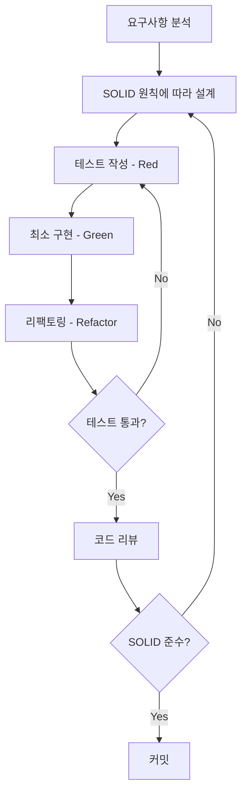

# 프로젝트 개발 규칙

이 프로젝트는 다음 두 가지 핵심 원칙을 따릅니다:

## 1. TDD (Test-Driven Development)

**코어 로직은 반드시 TDD로 구현합니다.**

### 적용 범위
- ✅ **필수**: `scripts/calculator/`, `scripts/state/`, `scripts/utils/`
- ⚠️ **선택**: `scripts/ui/` (UI 컨트롤러)
- ❌ **제외**: HTML, CSS, 설정 파일

### TDD 사이클
1. **Red**: 실패하는 테스트 작성
2. **Green**: 테스트를 통과하는 최소 코드 작성
3. **Refactor**: 코드 개선

### 상세 가이드
📖 [TDD 규칙 전체 문서](./tdd.md)

---

## 2. SOLID 원칙

**모든 코드는 SOLID 원칙을 준수합니다.**

### SOLID 5원칙
- **S**: Single Responsibility Principle (단일 책임 원칙)
- **O**: Open-Closed Principle (개방-폐쇄 원칙)
- **L**: Liskov Substitution Principle (리스코프 치환 원칙)
- **I**: Interface Segregation Principle (인터페이스 분리 원칙)
- **D**: Dependency Inversion Principle (의존성 역전 원칙)

### 핵심 체크포인트
- [ ] 각 클래스는 하나의 책임만 가지는가? (SRP)
- [ ] 확장에는 열려있고 수정에는 닫혀있는가? (OCP)
- [ ] 자식 클래스가 부모를 대체 가능한가? (LSP)
- [ ] 사용하지 않는 메서드에 의존하지 않는가? (ISP)
- [ ] 추상화에 의존하는가? (DIP)

### 상세 가이드
📖 [SOLID 원칙 전체 문서](./solid.md)

---

## 개발 워크플로우

### 새로운 기능 개발 시



### 체크리스트

#### 코드 작성 전
- [ ] 기능을 SOLID 원칙에 맞게 설계했는가?
- [ ] 클래스 책임이 명확히 분리되어 있는가?
- [ ] 의존성 주입을 고려했는가?

#### 코드 작성 중
- [ ] 테스트를 먼저 작성했는가? (TDD)
- [ ] Red → Green → Refactor 사이클을 따랐는가?
- [ ] 각 클래스가 단일 책임을 가지는가? (SRP)

#### 코드 작성 후
- [ ] 모든 테스트가 통과하는가?
- [ ] 테스트 커버리지가 목표를 달성했는가?
- [ ] SOLID 원칙을 위반하지 않았는가?
- [ ] 코드 리뷰를 받았는가?

---

## 코드 리뷰 가이드

### 리뷰어 체크리스트

#### TDD 관련
- [ ] 테스트가 먼저 작성되었는가?
- [ ] 테스트가 의미 있는가?
- [ ] 테스트 커버리지가 충분한가?
- [ ] 엣지 케이스를 고려했는가?

#### SOLID 관련
- [ ] 단일 책임 원칙을 준수하는가?
- [ ] 확장 가능한 구조인가?
- [ ] 추상화에 의존하는가?
- [ ] 인터페이스가 적절히 분리되어 있는가?

---

## 예시: 계산기 기능 추가

### 시나리오
새로운 삼각함수 기능을 추가한다.

### 1단계: SOLID 설계
```javascript
// S: 삼각함수 계산만 담당하는 클래스
// O: 새로운 함수 추가 시 기존 코드 수정 불필요
// D: MathEngine 추상화에 의존
class TrigonometricCalculator {
  constructor(mathEngine) {
    this.mathEngine = mathEngine; // 의존성 주입
  }
  
  sin(angle) {
    return this.mathEngine.evaluate(`sin(${angle})`);
  }
}
```

### 2단계: TDD 적용
```javascript
// Red: 실패하는 테스트 작성
describe('TrigonometricCalculator', () => {
  it('should calculate sin(30) as 0.5', () => {
    const mockEngine = { evaluate: vi.fn().mockReturnValue(0.5) };
    const calc = new TrigonometricCalculator(mockEngine);
    
    expect(calc.sin(30)).toBe(0.5);
  });
});

// Green: 테스트 통과하는 최소 구현
class TrigonometricCalculator {
  constructor(mathEngine) {
    this.mathEngine = mathEngine;
  }
  
  sin(angle) {
    return this.mathEngine.evaluate(`sin(${angle})`);
  }
}

// Refactor: 코드 개선
class TrigonometricCalculator {
  constructor(mathEngine, angleMode = 'deg') {
    this.mathEngine = mathEngine;
    this.angleMode = angleMode;
  }
  
  sin(angle) {
    const adjustedAngle = this.convertAngle(angle);
    return this.mathEngine.evaluate(`sin(${adjustedAngle})`);
  }
  
  convertAngle(angle) {
    return this.angleMode === 'deg' ? angle * Math.PI / 180 : angle;
  }
}
```

---

## 위반 사례 및 해결

### ❌ 안티패턴 1: SRP 위반
```javascript
class Calculator {
  calculate(expression) {
    const result = eval(expression);
    localStorage.setItem('result', result); // 저장 책임 추가
    document.getElementById('result').textContent = result; // UI 책임 추가
    return result;
  }
}
```

### ✅ 해결: 책임 분리
```javascript
class Calculator {
  constructor(storage, display) {
    this.storage = storage;
    this.display = display;
  }
  
  calculate(expression) {
    const result = eval(expression);
    this.storage.save('result', result);
    this.display.show(result);
    return result;
  }
}
```

### ❌ 안티패턴 2: TDD 미적용
```javascript
// 테스트 없이 구현부터 작성
class MathEngine {
  evaluate(expression) {
    // 복잡한 로직...
  }
}
```

### ✅ 해결: TDD 적용
```javascript
// 1. 테스트 먼저
describe('MathEngine', () => {
  it('should evaluate 2+3 as 5', () => {
    const engine = new MathEngine();
    expect(engine.evaluate('2+3')).toBe(5);
  });
});

// 2. 구현
class MathEngine {
  evaluate(expression) {
    return eval(expression);
  }
}
```

---

## 참고 문서

- 📖 [TDD 규칙 상세 가이드](./tdd.md)
- 📖 [SOLID 원칙 상세 가이드](./solid.md)
- 📖 [PRD - 제품 요구사항 문서](../PRD.md)
- 📖 [Tech Spec - 기술 명세서](../TechSpec.md)

---

## 질문과 답변

### Q: UI 코드도 TDD를 적용해야 하나요?
A: UI와 강하게 결합된 코드는 TDD 제외 가능합니다. 하지만 UI 로직을 분리하여 테스트 가능하게 만드는 것을 권장합니다.

### Q: JavaScript에는 인터페이스가 없는데 어떻게 SOLID를 적용하나요?
A: Duck Typing과 객체 구성(Composition)을 활용하여 SOLID 원칙을 적용할 수 있습니다. 추상 클래스나 프로토콜 패턴을 사용할 수도 있습니다.

### Q: 모든 코드에 SOLID를 적용해야 하나요?
A: 핵심 비즈니스 로직에는 반드시 적용하고, 간단한 유틸리티 함수나 설정 코드는 유연하게 판단합니다.

### Q: 테스트 커버리지 목표는 얼마인가요?
A: 코어 로직 95%, 유틸리티 90%, 상태 관리 85%, 전체 80% 이상을 목표로 합니다.

---

**마지막 업데이트**: 2025-12-23
